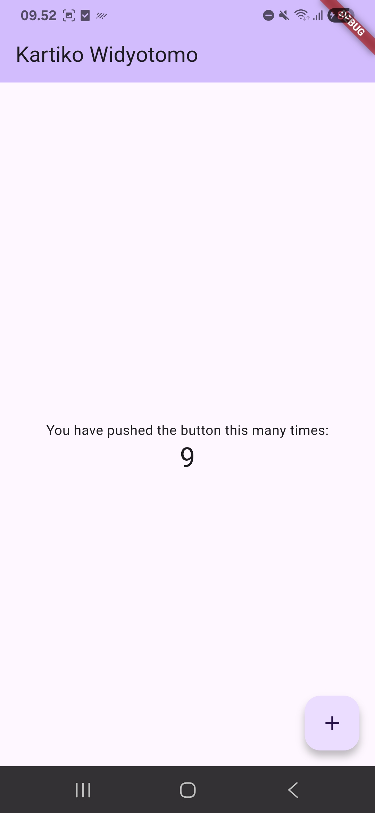

# hello_world

A new Flutter project.

.png)
Pada praktikum ini dilakukan pembuatan project baru menggunakan Flutter sebagai dasar pengembangan aplikasi mobile. Proses ini melibatkan penggunaan tools seperti Flutter SDK dan Visual Studio Code atau Android Studio. Setelah project berhasil dibuat, struktur folder seperti lib, android, dan pubspec.yaml otomatis terbentuk. File main.dart menjadi titik awal eksekusi aplikasi yang menampilkan tampilan default Flutter.

.png)
.jpeg)
Pada tahap ini, perangkat Android dihubungkan ke laptop sebagai media testing aplikasi. Proses dilakukan dengan mengaktifkan Developer Options dan USB Debugging pada perangkat, kemudian menggunakan perintah adb devices untuk memastikan koneksi berhasil. Setelah terhubung, perangkat dapat digunakan sebagai pengganti emulator sehingga aplikasi dapat dijalankan langsung di HP dengan performa yang lebih ringan dan realistis.

.jpeg)
Praktikum ini berfokus pada modifikasi tampilan aplikasi dengan mengubah judul yang ditampilkan pada AppBar. Perubahan dilakukan pada widget MaterialApp dan Scaffold, khususnya pada properti title dan AppBar. Hal ini menunjukkan bahwa Flutter menggunakan konsep widget tree, di mana setiap tampilan dapat dikustomisasi melalui parameter yang tersedia.

.jpeg)
.jpeg)
Pada praktikum ini dipelajari penggunaan widget dasar seperti Text dan Image. Widget dibuat dalam file terpisah untuk melatih modularisasi kode, kemudian di-import ke main.dart. Selain itu, dilakukan juga penggunaan asset gambar yang harus didaftarkan pada file pubspec.yaml. Praktikum ini menekankan pentingnya struktur proyek yang rapi serta pemahaman dasar dalam menampilkan konten visual pada aplikasi Flutter.

.jpeg)
.jpeg)
.jpeg)
.jpeg)
Praktikum ini membahas penggunaan berbagai widget lanjutan dari Material Design dan iOS Cupertino. Beberapa widget yang digunakan antara lain CupertinoButton, FloatingActionButton, Scaffold, AlertDialog, TextField, serta Date Picker. Setiap widget dibuat dalam file terpisah untuk menjaga keteraturan kode, kemudian dipanggil melalui main.dart. Praktikum ini menunjukkan bahwa Flutter mendukung berbagai gaya desain (Material dan Cupertino) serta menyediakan komponen interaktif seperti input pengguna dan dialog, sehingga aplikasi menjadi lebih dinamis dan user-friendly.