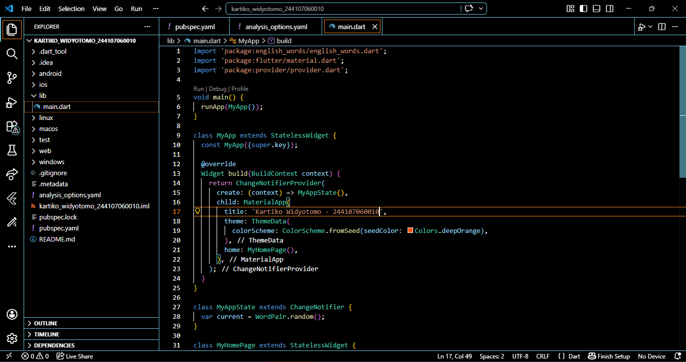
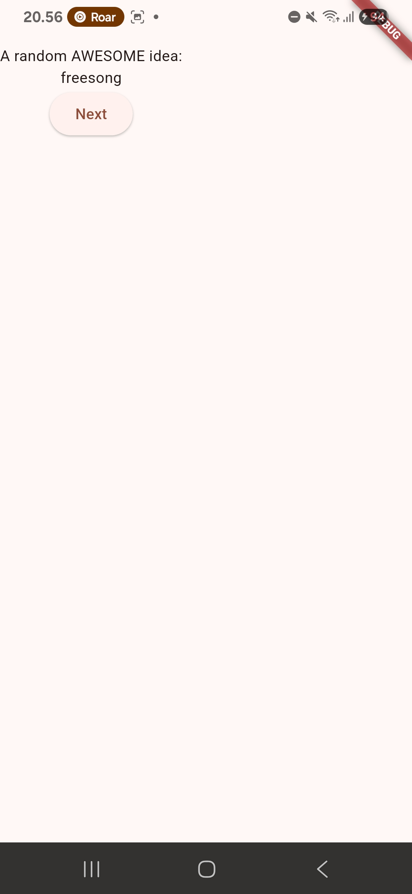
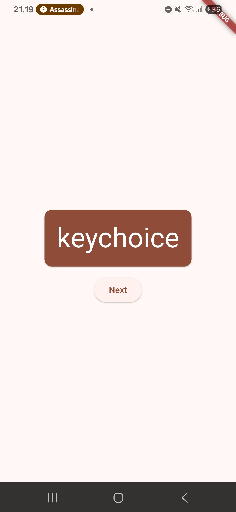
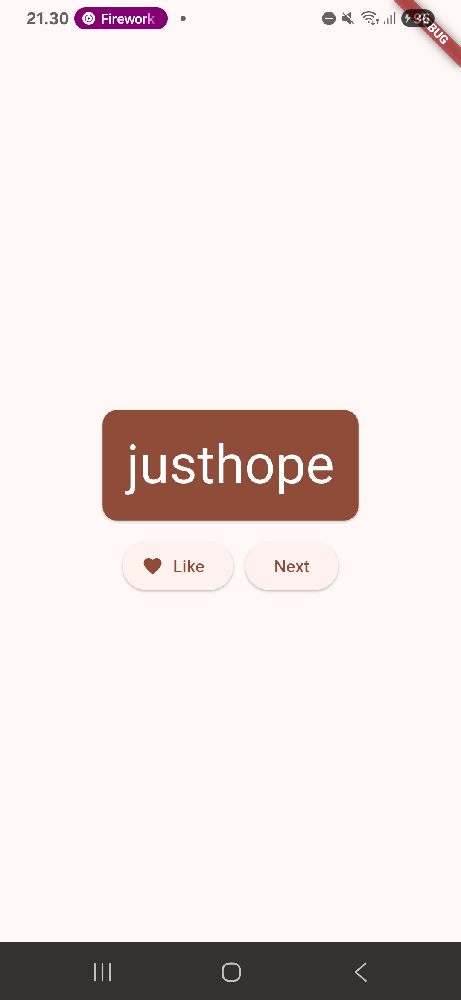
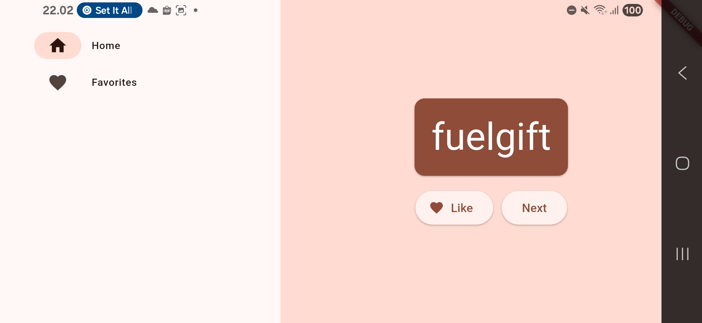
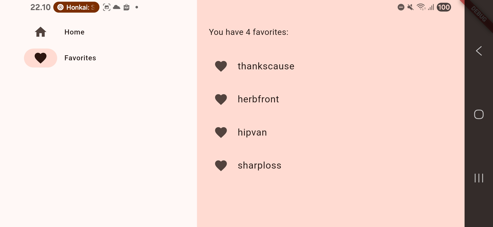

# kartiko_widyotomo_244107060010

A new Flutter project.

## Getting Started

Codelabs: Your first Flutter App

Halaman ini mengajarkan langkah dasar memulai proyek Flutter di VS Code, mulai dari inisialisasi proyek hingga mengonfigurasi tiga file inti seperti pubspec.yaml untuk mengelola dependencies, analysis_options.yaml untuk aturan penulisan kode, dan main.dart untuk membangun struktur awal aplikasi. Kita dipandu untuk menyiapkan seluruh kerangka dasar agar aplikasi siap dikembangkan secara interaktif.

Halaman ini mengajarkan kita cara menambahkan interaktivitas dengan tombol ElevatedButton dan fitur Hot Reload untuk melihat perubahan instan. Kita juga belajar menghubungkan logika bisnis ke tampilan menggunakan ChangeNotifier, di mana fungsi getNext() digunakan untuk memperbarui kata acak dan memberi tahu sistem agar mengubah tampilan layar secara otomatis.

Halaman ini mengajarkan kita cara mempercantik tampilan aplikasi dengan mengekstrak widget BigCard agar kode lebih rapi, serta menggunakan widget Card dan Padding untuk memberikan dimensi visual. Kita mempelajari penerapan tema aplikasi melalui Theme.of(context) agar warna dan gaya teks konsisten, sekaligus meningkatkan aksesibilitas menggunakan semanticsLabel untuk pembaca layar. Selain itu, kita juga mengatur tata letak agar lebih proporsional dengan menengahkan seluruh elemen menggunakan widget Center dan properti mainAxisAlignment pada Column.

Halaman ini menjelaskan cara menambahkan fitur "Like" untuk menyimpan pasangan kata favorit dengan memperbarui logika bisnis dan antarmuka aplikasi. Kita mempelajari cara membuat *list* `favorites` dan fungsi `toggleFavorite()` di dalam `MyAppState` untuk menambah atau menghapus kata dari daftar pilihan. Pada bagian UI, kita menggunakan widget `Row` untuk menyusun tombol secara horizontal dan `ElevatedButton.icon()` untuk menampilkan ikon hati yang berubah bentuk secara dinamis sesuai status favorit kata tersebut. Penggunaan `MainAxisSize.min` pada `Row` juga diperkenalkan agar tata letak tombol tetap rapi di tengah layar.

Halaman ini menjelaskan cara membuat sistem navigasi menggunakan NavigationRail dan memperkenalkan StatefulWidget untuk mengelola perpindahan layar. Kita mempelajari penggunaan setState() untuk mengubah variabel selectedIndex secara dinamis dan widget LayoutBuilder untuk membuat tampilan responsif yang menyesuaikan lebar layar. Dengan struktur ini, aplikasi dapat beralih antara halaman utama dan halaman favorit (yang sementara diisi oleh Placeholder) sambil menjaga tata letak tetap rapi menggunakan SafeArea dan Expanded.

Halaman ini menjelaskan pembuatan `FavoritesPage` untuk menggantikan `Placeholder` dengan daftar kata yang telah disukai. Kita mempelajari penggunaan widget **ListView** agar daftar dapat digulir dan **ListTile** untuk menampilkan setiap item secara rapi dengan ikon. Selain itu, kita menerapkan logika pengkondisian untuk menampilkan pesan jika daftar kosong, serta menggunakan perulangan `for` di dalam *widget tree* untuk merender seluruh data favorit dari `MyAppState`.