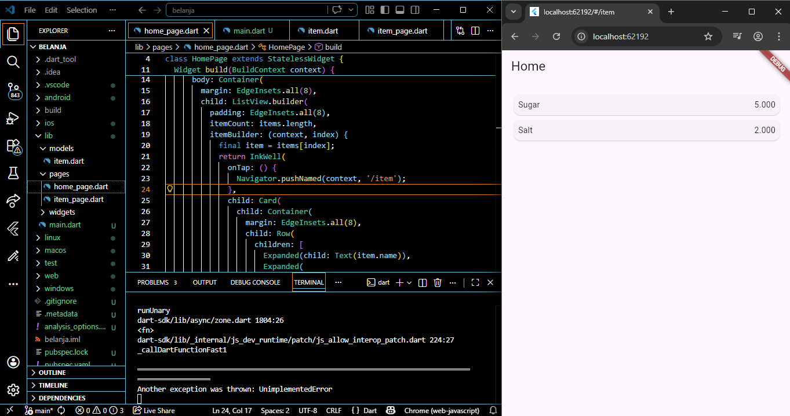
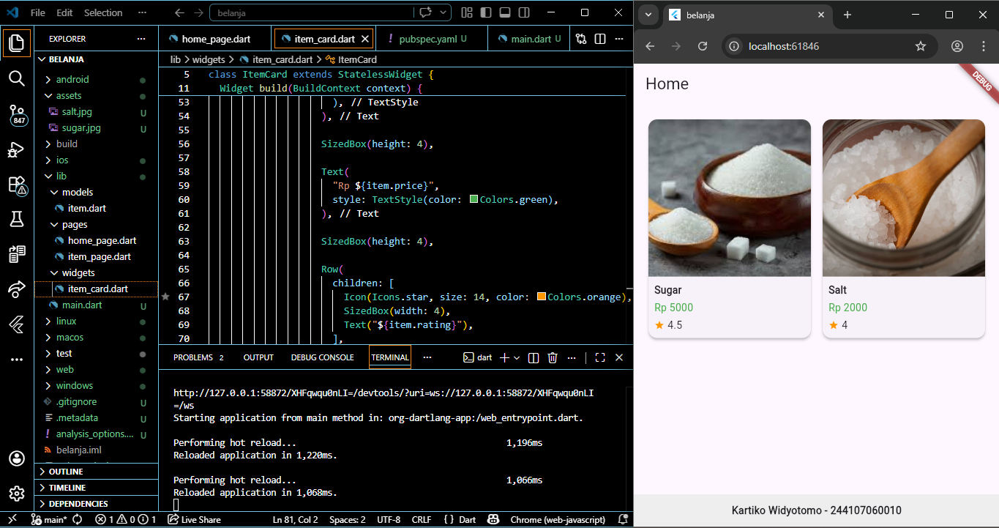
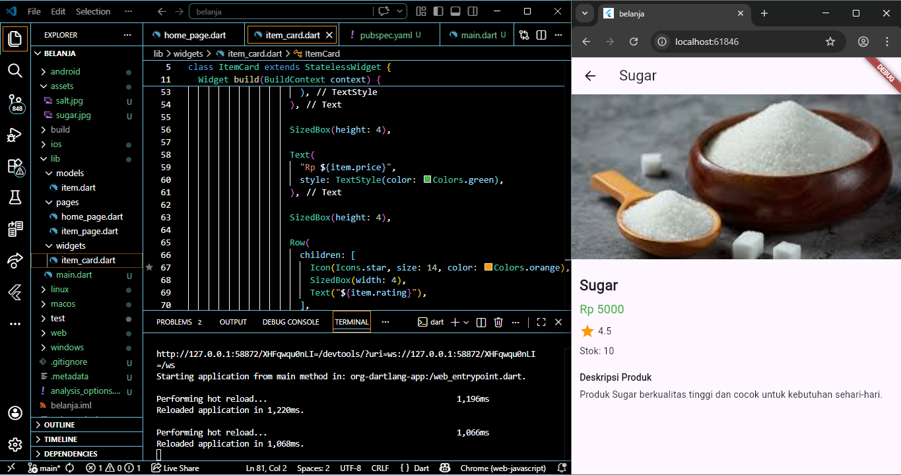

# belanja

A new Flutter project.

## Getting Started

Pada Praktikum 5, dilakukan pengembangan aplikasi Flutter dengan fokus pada navigasi dan tampilan UI, dimulai dari pembuatan model data item yang berisi atribut seperti nama, harga, gambar, stok, dan rating. Selanjutnya, ditampilkan daftar produk pada halaman utama menggunakan GridView agar menyerupai tampilan marketplace, kemudian ditambahkan interaksi klik untuk berpindah ke halaman detail dengan mengirim data antar halaman menggunakan Navigator maupun alternatif modern go_router. Di halaman detail, data diterima dan ditampilkan secara lebih lengkap serta diperindah dengan implementasi Hero animation untuk transisi gambar yang lebih halus. Selain itu, dilakukan pemecahan widget menjadi komponen kecil seperti ItemCard agar kode lebih rapi dan modular, penambahan footer berisi identitas, serta penyesuaian tampilan agar responsif dan menarik baik di mobile maupun web, sehingga menghasilkan aplikasi sederhana namun terstruktur dan interaktif.

Hasil Akhir

