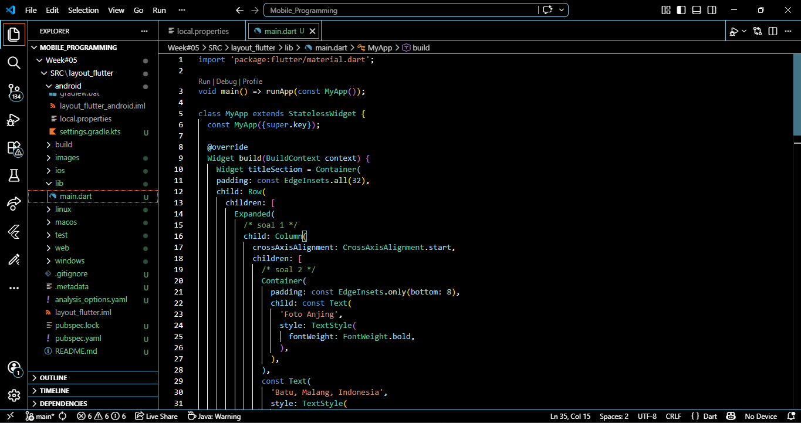
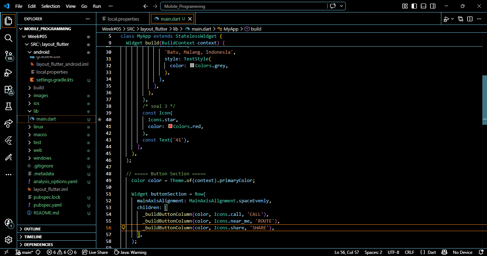
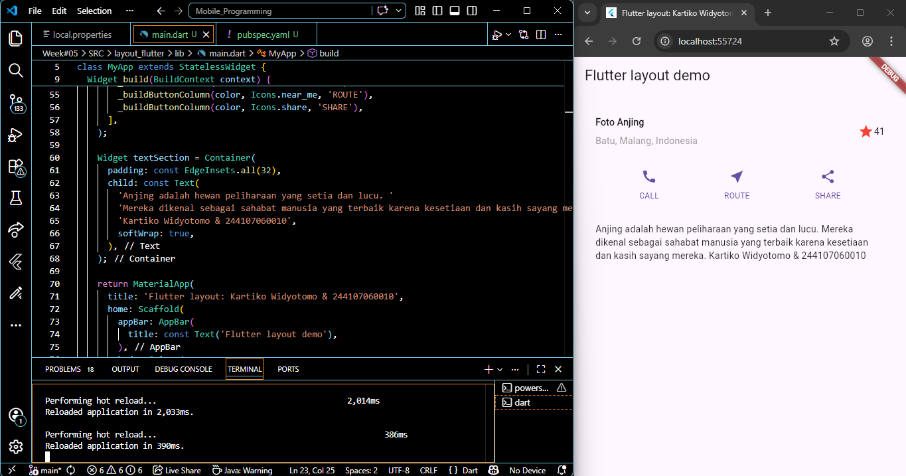
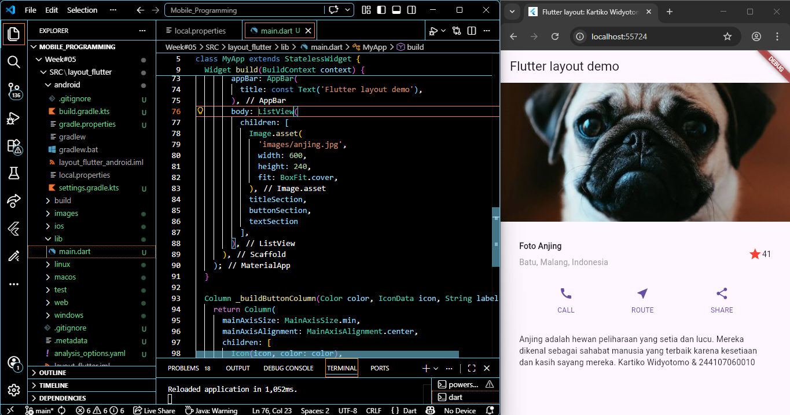

# layout_flutter

A new Flutter project.

## Pertemuan Ke-6 - Flutter 2

Praktikum pertama berfokus pada implementasi mekanisme tata letak di Flutter dengan membangun struktur UI secara bottom-up menggunakan widget Row dan Column. Melalui pembuatan variabel titleSection, saya mempelajari cara mengatur perataan komponen menggunakan CrossAxisAlignment, mengoptimalkan ruang dengan widget Expanded, serta memberikan estetika visual melalui pemberian padding dan pewarnaan pada ikon serta teks.

Praktikum kedua ini mengajarkan efisiensi kode melalui pembuatan method pembantu _buildButtonColumn untuk menghasilkan struktur kolom yang konsisten berisi ikon dan teks secara dinamis. Dengan memanfaatkan MainAxisAlignment.spaceEvenly pada widget Row, ketiga tombol (CALL, ROUTE, dan SHARE) dapat disusun dengan jarak yang presisi dan estetis, sekaligus mengintegrasikan Theme.of(context).primaryColor untuk menjaga konsistensi warna sesuai tema aplikasi.

Praktikum ketiga ini mengimplementasikan bagian konten menggunakan variabel `textSection`, di mana teks deskripsi dibungkus dalam widget `Container` dengan *padding* merata sebesar 32 unit untuk menjaga keterbacaan. Dengan mengaktifkan properti `softWrap: true`, teks dapat menyesuaikan lebar layar secara otomatis dan berpindah baris pada batas kata, sehingga memastikan tampilan deskripsi tempat wisata tetap rapi di berbagai ukuran perangkat.

Praktikum keempat ini menyempurnakan antarmuka dengan menambahkan elemen visual melalui widget `Image.asset` yang dikonfigurasi dengan `BoxFit.cover` agar gambar menutupi area render secara optimal. Sebagai langkah final, seluruh variabel layout (`titleSection`, `buttonSection`, dan `textSection`) disusun di dalam widget `ListView` untuk menggantikan `Column`, sehingga aplikasi memiliki kemampuan *scrolling* yang responsif dan mencegah terjadinya *layout overflow* pada perangkat dengan resolusi layar kecil.